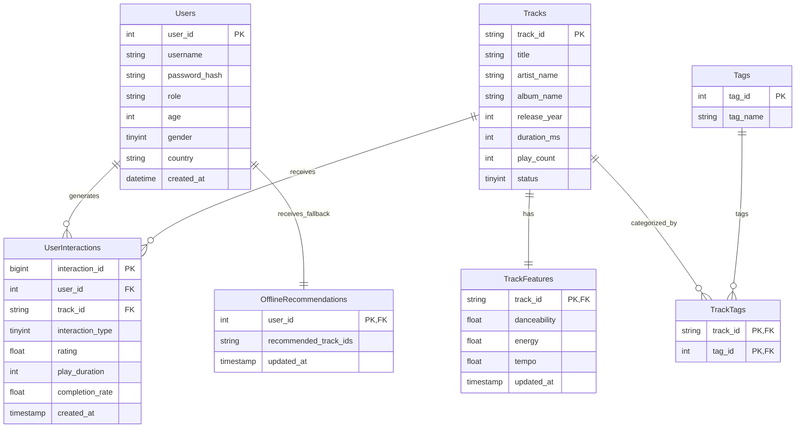

# 阶段一：数据库与数据模型设计

## 1. 概念设计 (Entity-Relationship Analysis)

音乐推荐系统主要涉及用户、音乐曲目、用户的交互行为（如播放、收藏、评分）以及音乐的多模态特征。基于系统非功能性和推荐模型的要求，实体与关系划分如下：
- **User (用户)** 包含了基础的业务属性及用于深度模型(如DeepFM)冷启动的**画像特征(Profile)**。
- **User** 与 **Track (歌曲)** 之间通过 **UserInteractions** 产生交互流水，精确记录了互动类型与**播放完成度**作为隐式负样本的重要判定指标。
- **Track (歌曲)** 支持软删除(软下架)，拥有对应的 **Feature (多模态声学特征)**，音频向量由于解耦需求，转移至专业向量数据库。
- **OfflineRecommendations** 用于离线推荐结果持久化，作为 Redis 在线缓存的兜底(Fallback)。

## 2. 逻辑设计 (数据字典)

### 2.1 用户表 (`users`)
存储系统用户的基本账号信息，并增补了人口统计学等画像特征，用于解决新用户冷启动与 DeepFM 等 CTR 模型所需的稠密/离散特征交叉。

| 字段名 | 数据类型 | 约束 | 是否为空 | 默认值 | 备注 |
| :--- | :--- | :--- | :--- | :--- | :--- |
| `user_id` | INT | PK, Auto Increment | 否 | - | 用户唯一主键 |
| `username` | VARCHAR(50) | UNIQUE | 否 | - | 用户名 |
| `password_hash` | VARCHAR(255) | - | 否 | - | 加密后的密码 |
| `role` | VARCHAR(20) | - | 否 | 'user' | 角色(user/admin) |
| `age` | INT | - | 是 | NULL | 用户画像：年龄 |
| `gender` | TINYINT | - | 是 | NULL | 用户画像：性别 (0=未知, 1=男, 2=女) |
| `country` | VARCHAR(50) | - | 是 | NULL | 用户画像：国家/地区 |
| `created_at` | TIMESTAMP | - | 否 | CURRENT_TIMESTAMP | 注册时间 |
| `last_login` | TIMESTAMP | - | 是 | NULL | 最后登录时间 |

### 2.2 歌曲表 (`tracks`)
存储音乐的基础元数据。考虑到公开数据集面临的下架情况，添加了 `status` 字段实施软删除。

| 字段名 | 数据类型 | 约束 | 是否为空 | 默认值 | 备注 |
| :--- | :--- | :--- | :--- | :--- | :--- |
| `track_id` | VARCHAR(64) | PK | 否 | - | 歌曲全局唯一标识 |
| `title` | VARCHAR(255) | - | 否 | - | 歌曲名称 |
| `artist_name` | VARCHAR(255) | - | 是 | NULL | 歌手/艺术家名称 |
| `album_name` | VARCHAR(255) | - | 是 | NULL | 专辑名称 |
| `release_year` | INT | - | 是 | NULL | 发行年份 |
| `duration_ms` | INT | - | 是 | NULL | 歌曲时长(毫秒) |
| `play_count` | INT | - | 否 | 0 | 历史总被播放次数 |
| `status` | TINYINT | - | 否 | 1 | 歌曲状态 (1=正常, 0=已下架) |
| `created_at` | TIMESTAMP | - | 否 | CURRENT_TIMESTAMP | 录入数据库时间 |

### 2.3 用户行为日志表 (`user_interactions`)
核心流水表，优化了数据类型与业务字段，直接支撑序列推荐模型和隐式负反馈样本的精细抽取。

| 字段名 | 数据类型 | 约束 | 是否为空 | 默认值 | 备注 |
| :--- | :--- | :--- | :--- | :--- | :--- |
| `interaction_id` | BIGINT | PK, Auto Increment | 否 | - | 日志主键 |
| `user_id` | INT | FK -> users(user_id) | 否 | - | 用户ID |
| `track_id` | VARCHAR(64)| FK -> tracks(track_id)| 否 | - | 歌曲ID |
| `interaction_type`| TINYINT | - | 否 | - | 交互类型(1=play, 2=like, 3=skip, 4=rate) |
| `rating` | FLOAT | - | 是 | NULL | 显式反馈评分(如果有) |
| `play_duration` | INT | - | 是 | NULL | 实际播放长度(毫秒) |
| `completion_rate`| FLOAT | - | 是 | NULL | 播放完成度 (play_duration / duration_ms) |
| `created_at` | TIMESTAMP | - | 否 | CURRENT_TIMESTAMP| 行为发生的时间戳 |

> [!TIP]
> `completion_rate` 的引入是为了科学划定“正负样本”边界。相比于单独看 `play_duration` 的绝对时长，相对值更能精准表达用户对一段音频内容的真实容忍度。

### 2.4 歌曲多模态特征表 (`track_features`)
出于存算解耦考虑，此关系型扩展表中**不再存放庞大的 Audio Embedding (BLOB)**，仅保留用于数据分析和辅助展示的标量型声学特征。稠密向量移交给专业的向量数据库接管。

| 字段名 | 数据类型 | 约束 | 是否为空 | 默认值 | 备注 |
| :--- | :--- | :--- | :--- | :--- | :--- |
| `track_id` | VARCHAR(64) | PK, FK -> tracks(track_id) | 否 | - | 关联歌曲ID |
| `danceability` | FLOAT | - | 是 | NULL | 舞蹈度(一种声学特征) |
| `energy` | FLOAT | - | 是 | NULL | 能量值(一种声学特征) |
| `tempo` | FLOAT | - | 是 | NULL | 音乐节拍数(BPM) |
| `updated_at` | TIMESTAMP | - | 否 | CURRENT_TIMESTAMP| 特征最近更新时间 |

### 2.5 离线推荐兜底持久化表 (`offline_recommendations`)
用于化解 Redis 全局缓存失效或大面积抖动而导致的推荐空白“灾难”，作为 Database Fallback 保障推荐基础可用。

| 字段名 | 数据类型 | 约束 | 是否为空 | 默认值 | 备注 |
| :--- | :--- | :--- | :--- | :--- | :--- |
| `user_id` | INT | PK, FK -> users(user_id) | 否 | - | 对应的用户ID |
| `recommended_track_ids`| JSON | - | 否 | - | 预先计算好的推荐 Item 列表 (JSON 数组) |
| `updated_at` | TIMESTAMP | - | 否 | CURRENT_TIMESTAMP| 上次离线推算时间 |

### 2.6 标签类表 (`tags` & `track_tags`)
用于丰富泛化内容特征。

**tags (标签表)**
* `tag_id` INT PK, `tag_name` VARCHAR(100) UNIQUE
**track_tags (歌曲标签关联表)**
* `track_id` VARCHAR(64) PK，`tag_id` INT PK。

---

## 3. 架构落地与性能优化策略

结合工程化生产经验，本模型设计附加以下核心性能策略保障：

1. **组合索引优化 (Composite Indexing)**
   - 包含正向序列索引 `IDX_user_time (user_id, created_at)`：支撑 BERT4Rec / SASRec 根据用户快速重构时间维度的“交互轨迹”。
   - **新增反向热度索引 `IDX_track_time (track_id, created_at)`**：专用于处理 Item Popularity 及全局冷启动热门召回，能在避免全表扫描的前提下，快速拉取单平台 T-24h 维度的歌曲热度。

2. **存储字段压缩**
   - 抛弃 VARCHAR 存储超大型枚举表流水（如日志），改用 TINYINT 保存 `interaction_type`。数亿级规模流水库可节省 G 级别存储成本，更使得 B+ 树的单页能够承载成倍节点的索引键，提升检索极值。
   - `tracks` 采用防范式（软删除设计），以 `status=0` 避免了删除后出现的级联外键约束爆炸并完美保留了已有的用户有效操作序列。

3. **存算彻底解耦 (向量数据库引入)**
   - 关系型存储 (MySQL) 将不承载 Embedding 存储与多维相似度运算的负担。**推荐采用如 Milvus 或 PostgreSQL+pgvector** 来专门存放 transformer 层的模型推断多模向量，与 MySQL 仅依靠 `track_id` 进行关联映射，保证数据库高速且高鲁棒。
