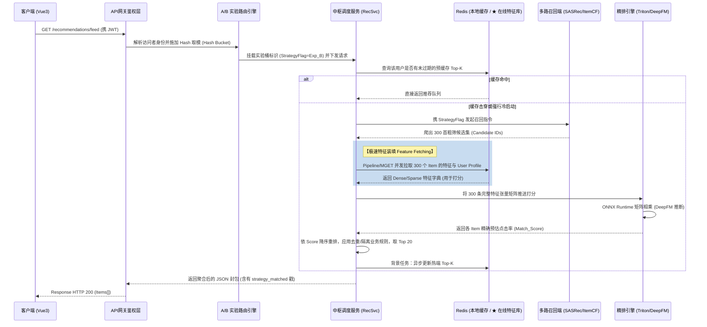

# 阶段三：详细实现设计 (Detailed Implementation Design)

在系统架构的高维蓝图确立后，结合高并发、实验迭代与攻防安全等“企业级深水区”痛点，本阶段将核心模块的具体运行范式和工程结构予以最严苛的打磨。

## 1. 核心业务流程图 (Core Business Workflows)

在此，我们着重审视“在线特征加载与分流”及“行为微批落盘”两大硬核链路。

### 1.1 在线混排推荐执行序列 (Sequence Diagram - A/B 分流与特征拉取)
彻底告别单体调用，拥抱工业界标准的 **“分流 -> 缓存 -> 召回 -> 【查特征】 -> 精排”** 管线。



### 1.2 高频行为日志异步上报流 (Activity Diagram - 微批处理防御锁死)
解决了“直接暴击关系型数据库”的反模式，确立流式微批次的数据治理闭环。

```mermaid
stateDiagram-v2
    direction TB
    
    state "客户端交互端" as ClientSide {
        [*] --> 音乐播放
        音乐播放 --> 切换歌曲/终止播放
        切换歌曲/终止播放 --> 触发 Beacon/Ajax 埋点事件
    }
    
    state "网关接入端" as MiddleTier {
        触发 Beacon/Ajax 埋点事件 --> Web服务接收校验层
        Web服务接收校验层 --> 立即无阻塞压入Kafka/MQ
    }
    
    state "MQ 消费与治理层 (Consumer Task)" as Streaming {
        立即无阻塞压入Kafka/MQ --> 实时流处理模块
        实时流处理模块 --> 更新Redis会话滑动窗口(SASRec输入)
        
        立即无阻塞压入Kafka/MQ --> 日志落盘消费者
        日志落盘消费者 --> 内存 Micro-Batch (如积攒500条)
        内存 Micro-Batch (如积攒500条) --> 聚合写入ClickHouse / 离线云Parquet
    }

    state "算法离线定型区 (Airflow/PyTorch)" as OfflineML {
        聚合写入ClickHouse / 离线云Parquet --> 大数据ETL(提取完播率等特征)
        大数据ETL(提取完播率等特征) --> 发送至 GPU 集群重训网络
        发送至 GPU 集群重训网络 --> 导出并翻越部署新一轮 ONNX 权重
    }
    
    ClientSide --> MiddleTier
    MiddleTier --> Streaming
    Streaming --> OfflineML
```

---

## 2. 模块物理划分 (Monorepo Directory & Data Contract)

增加物理级的“共享契约”层，打破“Web 工程开发”和“AI 数据流清洗”在数据字段上互相盲猜的隔离僵局。

```text
📂 music_rec_system_monorepo/
├── 📂 shared_contracts/         # 【★ 特别新增：跨端数据契约层】 使用 JSON Schema 或 Protobufs
│                                # 强制统一全栈对 Kafka 消息结构 (如 InteractionEvent) 的严格共识，消除上下游对不齐的灾难
│
├── 📂 app/                      # 【后端主 Web 服务】 (FastAPI)
│   ├── 📂 api/                  # 表现控制器 (Router Endpoints)
│   ├── 📂 models/               # 数据连接实体 (ORM layer)
│   ├── 📂 schemas/              # 内部表单及响应接口切面 (Pydantic DTO)
│   ├── 📂 services/             # 复杂业务流编排 (RecSvc, A/B Testing)
│   └── 📂 utils/                # 外部缓存/中间件驱动实例池
│
├── 📂 ml_pipeline/              # 【算法与数据管线】 (PyTorch & Data Eng)
│   ├── 📂 data_process/         # 离线数据 ETL 脚本 (吸纳 shared_contracts 定义解析 Parquet)
│   ├── 📂 models/               # 深度网络定义 (SASRec, DeepFM)
│   └── 📂 inference/            # 打分模型导出及 Triton/ONNX 挂载配置
│
└── 📂 frontend_vue/             # 【前台控制层】Vue3 + Vite
```

---

## 3. 异常处理与安全策略设计 (Security & Defensive Engineering)

### 3.1 双 Token 防御架构 (JWT Security Paradigm)
彻底摒弃单一 JWT 配置造成的“XSS 与 CSRF 顾此失彼”漏洞，引入当今前沿系统金标准防御阵线：
1. **短寿 Access Token 在内存 / LocalStorage**：设定过期时间极短（如 15 分钟），负责承受所有 API 高频校验。放在非 Cookie 空间内能 100% 免疫 CSRF（跨站请求伪造）利用浏览器自动带 Cookie 的攻击死穴。即便遇上 XSS 被窃取，其伤害生命周期也极有限。
2. **长寿 Refresh Token 在 HTTP-Only Strict Cookie**：设定过期时间为 7 天。因带有 `HTTP-Only` 和 `SameSite=Strict`，任何注入前端的 XSS JS代码都无权读取它。当 Access Token 过期时，通过一个特定接口带着不可见的 Cookie 去默默兑换出崭新的 Access Token。

### 3.2 离线微批处理降级防御 (Micro-Batching against IOPS Exhaustion)
对于日志落盘消费者（Consumer），严禁实施 `while True: insert 1 row`。底层采用强制定时触发（如 Tick=5s）与 容量上限（Count=500）的“阀门控制”。极端的洪峰流量会被稳稳吸收在 Kafka 队列中慢慢消化，而非压垮后续依赖的 ClickHouse 或落盘文件系统 IOPS。

### 3.3 无回显安全抛错机制 (Sanitized Exceptions)
全局应用统一异常拦截网。即使由于 Redis 断连、网络游标断线或者 GPU 推断 OOM，底层一切抛出的带堆栈和包路径的 Exception 数据全面封锁在企业日志内，向 HTTP Response 仅仅呈现经过脱敏降解后的 5xx 通用 JSON。保护物理文件与网络内部署架构底牌。
