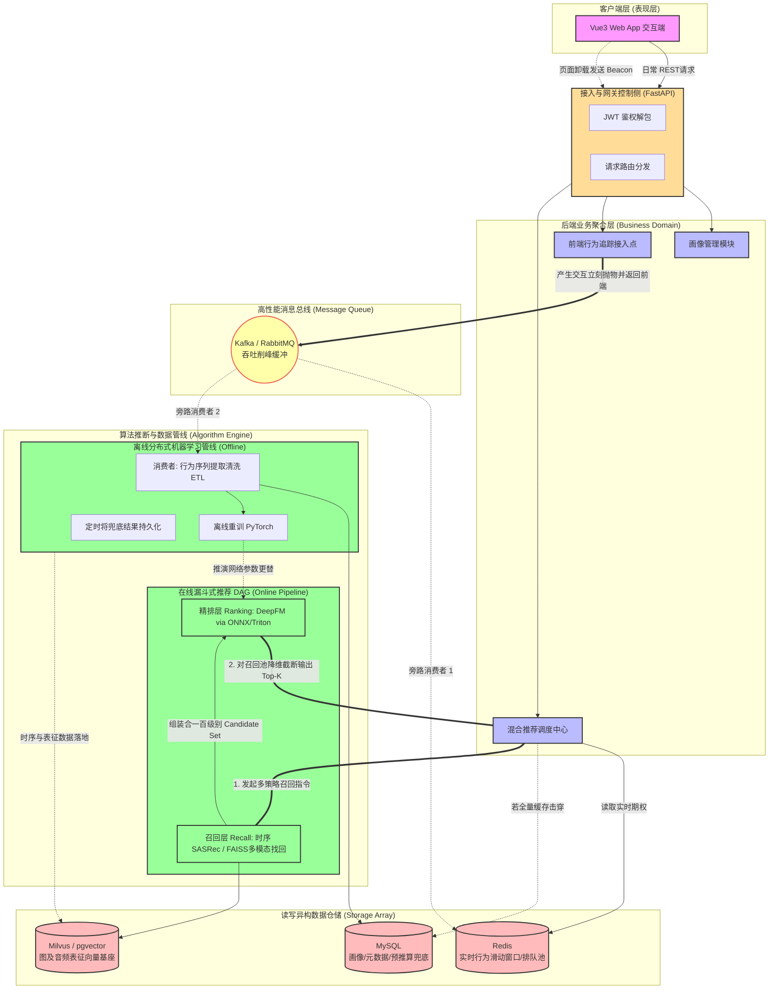

# 阶段二：系统架构设计

## 1. 技术栈确认

本系统旨在探索并对比各类主流及前沿的序列与多模态推荐范式。经过评审优化，为满足工业级真实高吞吐与容灾要求，基础设施严格遵照“计算解耦”与“读写异构”设计：

1. **前端层 (Front-end)**: **Vue 3 + TypeScript + Pinia**
   * **选型理由**: Vue 3 的组合式 API 提供了优异的组件状态切分与逻辑复用机制，配合 TypeScript 的强类型安全检查，极大提升了对复杂音乐播放状态树和海量推荐面板的工程化运维能力。
2. **后端网关及业务层 (Back-end)**: **FastAPI (基于 Python 3.10+)**
   * **选型理由**: ASGI 异步框架抗大并发 IO。它作为 Web 接入的胶水层，负责鉴权、调用底层服务并下发响应。
3. **模型推理引擎 (Inference Engine)**: **ONNX Runtime / Triton Inference Server** (新增)
   * **选型理由**: **【极度关键】** Python FastAPI 若直接使用 PyTorch 同步去执行庞大的 Transformer 等网络推理，会导致全局解释器锁 (GIL) 死锁，拖垮 Web 吞吐。故必须将训练出来的 PyTorch 模型转为 ONNX 格式，通过 ONNX Runtime 或挂载外置的 Triton Server 依靠 C++/GPU 引擎来完成极速在线评测打分。
4. **消息中间件 (Message Queue)**: **Kafka / RabbitMQ** (新增)
   * **选型理由**: 用户海量且零碎的播放流日志绝对不能直接冲击关系型连接池。借助消息中间件实现高可用缓冲削峰，保证上游业务不堵塞，并将实时数据清洗（入 Redis）和离线落盘归档（ETL）从架构级相互剥离。
5. **数据与持久化层 (Storage)**: **MySQL 8.0 + Redis 7.x + Milvus**
   * **选型理由**: MySQL 为核心元数据提供强事务支撑；Redis 维护近线的高频 Session 更新及推荐排队的极速读取；**Milvus (或 pgvector)** 是承载与业务系统解耦了数万维音频特征进行近距离 ANN 计算的多模态向量基座。
6. **部署策略 (Deployment)**: **Docker + Docker Compose**
   * **选型理由**: 在微服务体系中彻底屏蔽环境依赖差异，支持开箱即用。

---

## 2. 系统核心架构图 (Logical & End-to-End Pipeline)

系统的核心理念为“分离关注点”，在此图中，我们更清晰地将算法推理定义为了标准的工业漏斗：召回 (Recall) -> 排序 (Ranking)。并强化了中间件消息屏障机制：



---

## 3. 接口规范与核心 API 设计

### 3.1 引入上下文锚点的推荐拉取 (Get Personalized Feed)

彻底解决了如果系统遇见“全新小白用户”没有历史的痛点，该接口能携带外部场景与瞬时的瞬态锚点作为多模召回条件。

- **Endpoint**: `GET /api/v1/recommendations/feed`
- **Request Parameters**:
  - `size` (Query) : 获取歌曲数目（默认20）。
  - `scene` (Query): 请求场景标识 (e.g., `home_feed`, `daily_mix`)。
  - **`current_track_id`** (Query): (新增)可选。当用户点击某首歌引发的“猜你喜欢”时，提供强大的 Seed Context 锚点做 Item 级别拓展。
  - **`device_info`** (Query): (新增)可选。包含 `{"timezone":"Asia/Shanghai"}`，即使对于无序新账户也可以快速推测所处区域的最热榜单作 Default Baseline。
- **Response Example**:
  ```json
  {
    "code": 200, "msg": "success",
    "data": {
      "strategy_matched": "SASRec_Recall_DeepFM_Rank", // 反馈命中具体算法
      "is_fallback": false,
      "items": [
        {
          "track_id": "T889201",
          "title": "Starboy",
          "artist_name": "The Weeknd",
          "duration_ms": 230400,
          "audio_url": "...",
          "score": 0.9631
        }
      ]
    }
  }
  ```

### 3.2 绝对防丢策略保护的事件流上报 (Log Interaction Event)

由于极易发生在用户切换页面或者强制关闭浏览器时的事件丢失，特别新增前端静默提交退路。

- **Endpoint**: `POST /api/v1/interactions`
- **调用规范要求**: 
  - 常驻页面交互：发送标准 AJAX/Axios HTTP POST。
  - **退杀、组件 Unload 阶段：前端必须降级使用 `navigator.sendBeacon('/api/v1/interactions', BlobData)`** ，由浏览器底层调度保障异步出列报文在页面销毁后依然触达网关，维护了每一条时序数据的珍贵生命周期。
- **Request Header**: Authorization JWT（如适用），否则记为匿名时段 Session ID。
- **Request Body**:
  ```json
  {
    "track_id": "T889201",
    "interaction_type": 1, 
    "play_duration": 185000, 
    "client_timestamp": 1712130022 
  }
  ```
- **Response**: 返回标准 HTTP 201（但在 Beacon 模式下由网关默默吃下，前端不捕获应答，直接入队 Kafka）。
